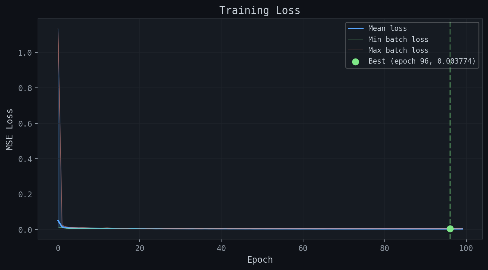
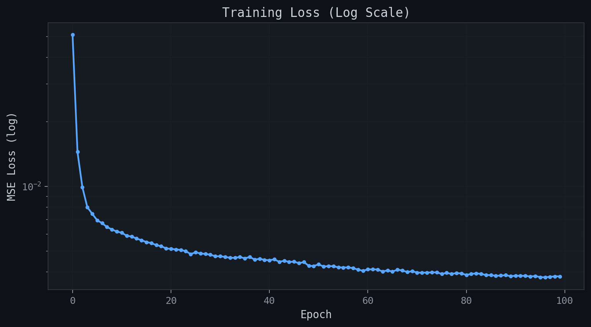
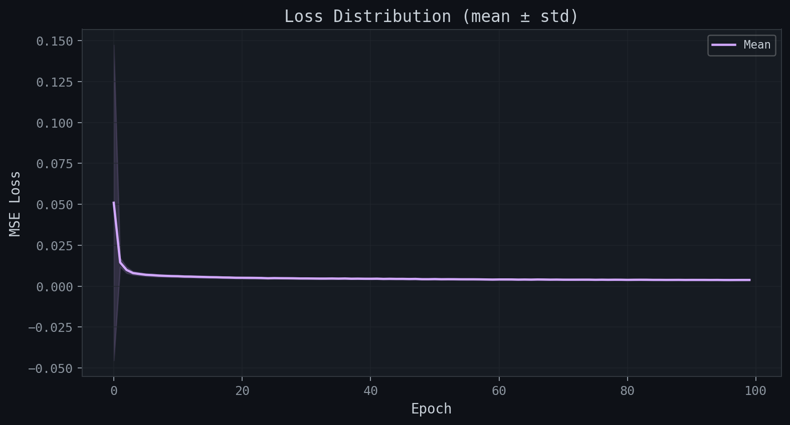
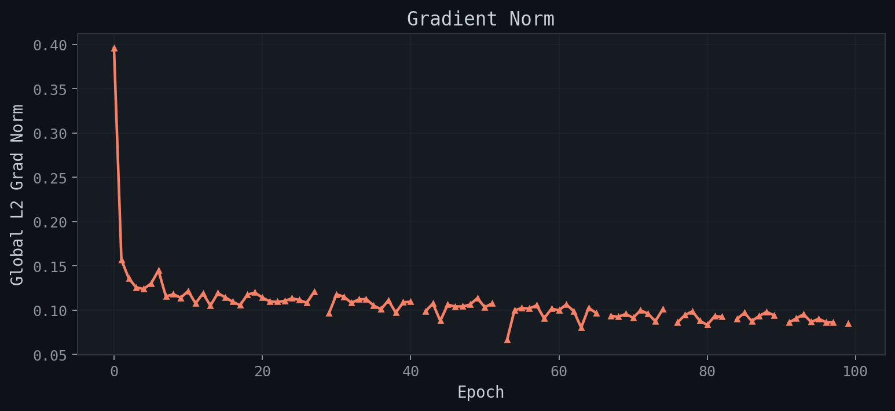
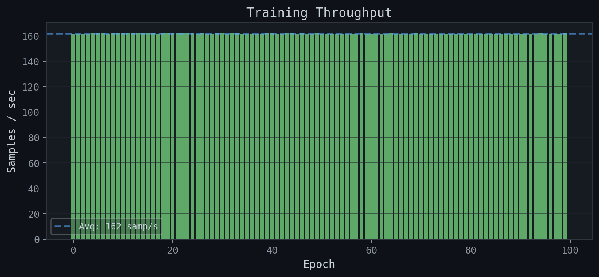
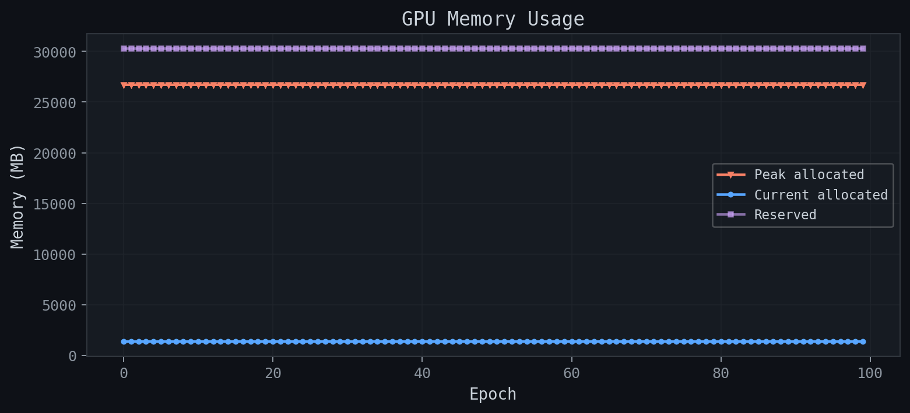
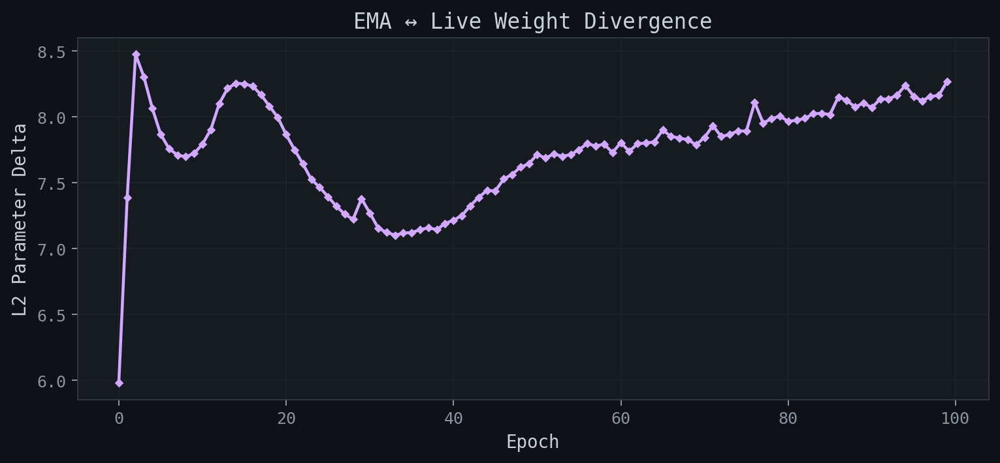
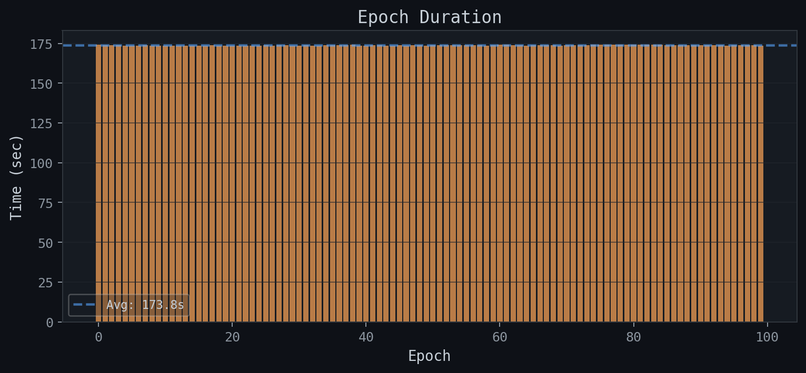
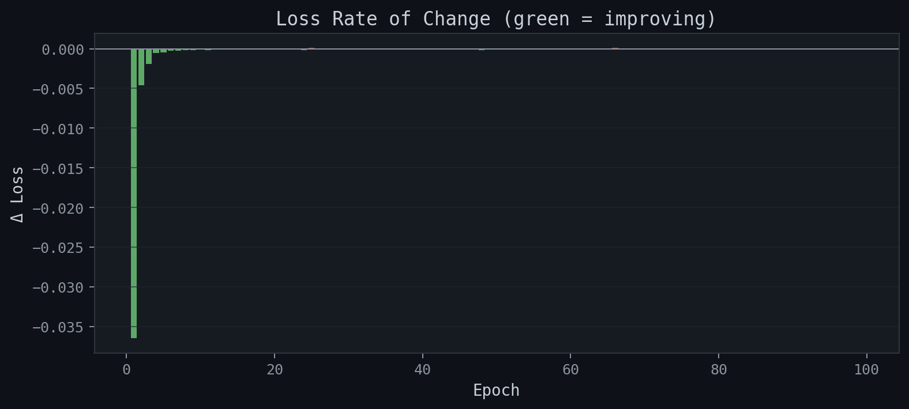
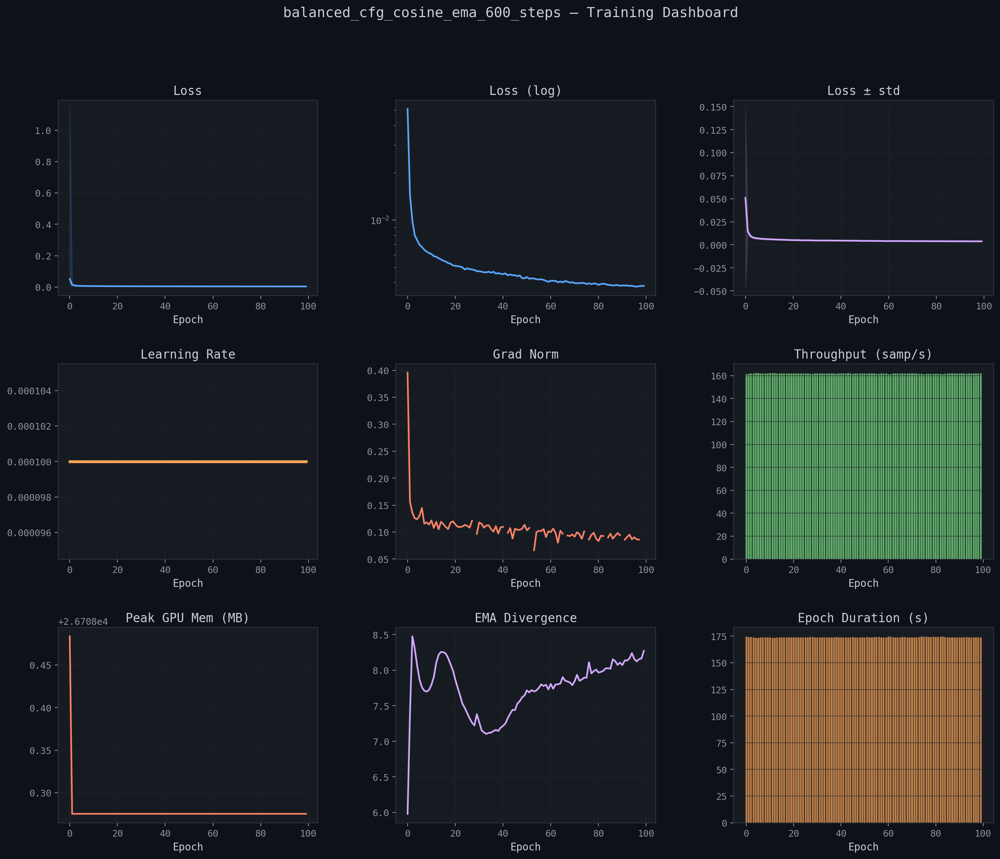

# Training Report: balanced_cfg_cosine_ema_600_steps

**Generated:** 2026-02-22 04:55:54
**Host:** midway3-0427.rcc.local
**Platform:** Linux-4.18.0-305.3.1.el8.x86_64-x86_64-with-glibc2.28
**PyTorch:** 2.9.0+cu126
**GPU:** NVIDIA L40S × 4

## Summary

| Metric | Value |
|--------|-------|
| total_epochs | 100 |
| total_samples | 2812800 |
| total_time_sec | 17404.804607 |
| total_time_human | 4:50:04 |
| best_epoch | 96 |
| best_loss | 0.003774 |
| final_loss | 0.003812 |
| final_lr | 0.000100 |
| avg_throughput_sps | 161.798317 |
| peak_gpu_mem_mb | 26708.483584 |

## Hyperparameters

```json
{
  "model_name": "balanced_cfg_cosine_ema_600_steps",
  "size_name": "large",
  "image_resolution": 96,
  "batch_size_per_gpu": 96,
  "block_out_channels": [
    96,
    192,
    384,
    384
  ],
  "dataset_split": "balanced",
  "epochs": 100,
  "learning_rate": 0.0001,
  "diffusion_steps": 600,
  "beta_schedule": "squaredcos_cap_v2",
  "ema_decay": 0.999,
  "cfg_dropout_prob": 0.1,
  "num_classes": 47,
  "null_class_index": 47,
  "num_gpus": 4,
  "optimizer": "AdamW",
  "mixed_precision": "float16"
}
```

## Per-Epoch Metrics

| Epoch | Loss (mean) | Loss (std) | Loss (min) | Loss (max) | LR | Grad Norm | Samples/s | GPU Peak MB | EMA Δ | Time (s) |
|-------|-------------|------------|------------|------------|-----|-----------|-----------|-------------|-------|----------|
|   0 | 0.050978 | 0.096340 | 0.013426 | 1.134416 | 1.00e-04 | 0.3956 | 161 | 26708 | 5.9804 | 174.4 |
|   1 | 0.014498 | 0.002676 | 0.009464 | 0.024279 | 1.00e-04 | 0.1568 | 162 | 26708 | 7.3881 | 174.1 |
|   2 | 0.009908 | 0.001854 | 0.006511 | 0.015193 | 1.00e-04 | 0.1358 | 162 | 26708 | 8.4762 | 173.9 |
|   3 | 0.008014 | 0.001019 | 0.005594 | 0.012265 | 1.00e-04 | 0.1257 | 162 | 26708 | 8.3045 | 173.8 |
|   4 | 0.007459 | 0.000940 | 0.005329 | 0.011372 | 1.00e-04 | 0.1239 | 162 | 26708 | 8.0671 | 173.5 |
|   5 | 0.006965 | 0.000810 | 0.005080 | 0.009344 | 1.00e-04 | 0.1301 | 162 | 26708 | 7.8694 | 173.5 |
|   6 | 0.006748 | 0.000828 | 0.004826 | 0.010326 | 1.00e-04 | 0.1448 | 162 | 26708 | 7.7601 | 173.7 |
|   7 | 0.006473 | 0.000797 | 0.004661 | 0.009432 | 1.00e-04 | 0.1155 | 162 | 26708 | 7.7113 | 173.8 |
|   8 | 0.006307 | 0.000679 | 0.004850 | 0.008573 | 1.00e-04 | 0.1181 | 162 | 26708 | 7.6982 | 173.7 |
|   9 | 0.006163 | 0.000657 | 0.004613 | 0.008373 | 1.00e-04 | 0.1139 | 162 | 26708 | 7.7233 | 173.6 |
|  10 | 0.006087 | 0.000672 | 0.004162 | 0.008070 | 1.00e-04 | 0.1217 | 162 | 26708 | 7.7949 | 173.6 |
|  11 | 0.005893 | 0.000655 | 0.004639 | 0.008440 | 1.00e-04 | 0.1077 | 162 | 26708 | 7.9055 | 173.5 |
|  12 | 0.005848 | 0.000681 | 0.004097 | 0.009356 | 1.00e-04 | 0.1191 | 162 | 26708 | 8.1009 | 173.4 |
|  13 | 0.005722 | 0.000645 | 0.004263 | 0.008344 | 1.00e-04 | 0.1052 | 162 | 26708 | 8.2178 | 173.7 |
|  14 | 0.005619 | 0.000647 | 0.004071 | 0.007699 | 1.00e-04 | 0.1192 | 162 | 26708 | 8.2566 | 173.7 |
|  15 | 0.005507 | 0.000607 | 0.004025 | 0.007273 | 1.00e-04 | 0.1145 | 162 | 26708 | 8.2523 | 173.7 |
|  16 | 0.005451 | 0.000572 | 0.003920 | 0.007019 | 1.00e-04 | 0.1094 | 162 | 26708 | 8.2342 | 173.7 |
|  17 | 0.005329 | 0.000542 | 0.003887 | 0.006870 | 1.00e-04 | 0.1056 | 162 | 26708 | 8.1685 | 173.8 |
|  18 | 0.005274 | 0.000635 | 0.003943 | 0.008069 | 1.00e-04 | 0.1176 | 162 | 26708 | 8.0825 | 173.7 |
|  19 | 0.005145 | 0.000560 | 0.004011 | 0.008152 | 1.00e-04 | 0.1198 | 162 | 26708 | 7.9973 | 173.7 |
|  20 | 0.005117 | 0.000542 | 0.003820 | 0.007225 | 1.00e-04 | 0.1142 | 162 | 26708 | 7.8662 | 173.7 |
|  21 | 0.005092 | 0.000604 | 0.003722 | 0.007559 | 1.00e-04 | 0.1099 | 162 | 26708 | 7.7521 | 173.7 |
|  22 | 0.005060 | 0.000550 | 0.003675 | 0.006757 | 1.00e-04 | 0.1094 | 162 | 26708 | 7.6437 | 173.7 |
|  23 | 0.004996 | 0.000586 | 0.003829 | 0.007099 | 1.00e-04 | 0.1105 | 162 | 26708 | 7.5273 | 173.7 |
|  24 | 0.004843 | 0.000525 | 0.003658 | 0.007296 | 1.00e-04 | 0.1134 | 162 | 26708 | 7.4669 | 173.7 |
|  25 | 0.004935 | 0.000552 | 0.003763 | 0.007117 | 1.00e-04 | 0.1116 | 162 | 26708 | 7.3952 | 173.8 |
|  26 | 0.004875 | 0.000511 | 0.003543 | 0.006517 | 1.00e-04 | 0.1082 | 162 | 26708 | 7.3222 | 173.7 |
|  27 | 0.004849 | 0.000511 | 0.003695 | 0.006472 | 1.00e-04 | 0.1210 | 162 | 26708 | 7.2626 | 174.0 |
|  28 | 0.004810 | 0.000509 | 0.003503 | 0.006438 | 1.00e-04 | inf | 162 | 26708 | 7.2236 | 174.0 |
|  29 | 0.004730 | 0.000464 | 0.003515 | 0.006503 | 1.00e-04 | 0.0967 | 162 | 26708 | 7.3805 | 173.7 |
|  30 | 0.004729 | 0.000487 | 0.003685 | 0.006335 | 1.00e-04 | 0.1178 | 162 | 26708 | 7.2713 | 173.7 |
|  31 | 0.004697 | 0.000469 | 0.003624 | 0.006521 | 1.00e-04 | 0.1152 | 162 | 26708 | 7.1563 | 173.8 |
|  32 | 0.004655 | 0.000508 | 0.003462 | 0.006437 | 1.00e-04 | 0.1083 | 162 | 26708 | 7.1246 | 173.7 |
|  33 | 0.004651 | 0.000490 | 0.003665 | 0.006847 | 1.00e-04 | 0.1121 | 162 | 26708 | 7.1032 | 173.7 |
|  34 | 0.004696 | 0.000522 | 0.003464 | 0.006330 | 1.00e-04 | 0.1126 | 162 | 26708 | 7.1187 | 173.8 |
|  35 | 0.004625 | 0.000443 | 0.003710 | 0.006196 | 1.00e-04 | 0.1053 | 162 | 26708 | 7.1227 | 173.8 |
|  36 | 0.004698 | 0.000523 | 0.003596 | 0.006827 | 1.00e-04 | 0.1010 | 162 | 26708 | 7.1441 | 173.9 |
|  37 | 0.004562 | 0.000456 | 0.003684 | 0.006451 | 1.00e-04 | 0.1111 | 162 | 26708 | 7.1601 | 173.8 |
|  38 | 0.004603 | 0.000476 | 0.003560 | 0.006723 | 1.00e-04 | 0.0973 | 161 | 26708 | 7.1446 | 174.2 |
|  39 | 0.004549 | 0.000437 | 0.003571 | 0.005900 | 1.00e-04 | 0.1089 | 162 | 26708 | 7.1921 | 173.7 |
|  40 | 0.004531 | 0.000452 | 0.003482 | 0.006398 | 1.00e-04 | 0.1096 | 162 | 26708 | 7.2167 | 173.7 |
|  41 | 0.004579 | 0.000551 | 0.003475 | 0.006906 | 1.00e-04 | inf | 162 | 26708 | 7.2519 | 173.8 |
|  42 | 0.004454 | 0.000440 | 0.003505 | 0.005886 | 1.00e-04 | 0.0987 | 162 | 26708 | 7.3260 | 173.8 |
|  43 | 0.004509 | 0.000510 | 0.003425 | 0.006675 | 1.00e-04 | 0.1075 | 162 | 26708 | 7.3899 | 173.6 |
|  44 | 0.004453 | 0.000431 | 0.003583 | 0.006025 | 1.00e-04 | 0.0881 | 162 | 26708 | 7.4426 | 173.6 |
|  45 | 0.004462 | 0.000464 | 0.003449 | 0.005800 | 1.00e-04 | 0.1063 | 162 | 26708 | 7.4389 | 174.0 |
|  46 | 0.004393 | 0.000451 | 0.003411 | 0.005838 | 1.00e-04 | 0.1041 | 162 | 26708 | 7.5295 | 173.7 |
|  47 | 0.004444 | 0.000480 | 0.003440 | 0.006406 | 1.00e-04 | 0.1042 | 162 | 26708 | 7.5640 | 173.8 |
|  48 | 0.004269 | 0.000413 | 0.003458 | 0.006336 | 1.00e-04 | 0.1063 | 162 | 26708 | 7.6190 | 173.8 |
|  49 | 0.004261 | 0.000402 | 0.003463 | 0.005639 | 1.00e-04 | 0.1136 | 162 | 26708 | 7.6446 | 173.7 |
|  50 | 0.004337 | 0.000477 | 0.003299 | 0.006065 | 1.00e-04 | 0.1033 | 162 | 26708 | 7.7163 | 173.8 |
|  51 | 0.004233 | 0.000440 | 0.003298 | 0.005654 | 1.00e-04 | 0.1077 | 162 | 26708 | 7.6882 | 173.9 |
|  52 | 0.004260 | 0.000440 | 0.003357 | 0.006111 | 1.00e-04 | inf | 162 | 26708 | 7.7201 | 173.8 |
|  53 | 0.004249 | 0.000451 | 0.003167 | 0.005931 | 1.00e-04 | 0.0664 | 162 | 26708 | 7.7015 | 173.8 |
|  54 | 0.004200 | 0.000437 | 0.003333 | 0.006206 | 1.00e-04 | 0.0998 | 162 | 26708 | 7.7151 | 173.9 |
|  55 | 0.004192 | 0.000468 | 0.003195 | 0.006060 | 1.00e-04 | 0.1024 | 162 | 26708 | 7.7517 | 174.0 |
|  56 | 0.004197 | 0.000438 | 0.003204 | 0.005646 | 1.00e-04 | 0.1019 | 162 | 26708 | 7.8001 | 174.0 |
|  57 | 0.004163 | 0.000428 | 0.003107 | 0.005830 | 1.00e-04 | 0.1055 | 162 | 26708 | 7.7781 | 173.8 |
|  58 | 0.004100 | 0.000371 | 0.003208 | 0.005158 | 1.00e-04 | 0.0907 | 162 | 26708 | 7.7950 | 173.7 |
|  59 | 0.004048 | 0.000417 | 0.003155 | 0.005319 | 1.00e-04 | 0.1016 | 162 | 26708 | 7.7297 | 173.8 |
|  60 | 0.004109 | 0.000419 | 0.003215 | 0.005611 | 1.00e-04 | 0.0999 | 161 | 26708 | 7.8062 | 174.3 |
|  61 | 0.004111 | 0.000430 | 0.003314 | 0.006202 | 1.00e-04 | 0.1065 | 161 | 26708 | 7.7386 | 174.3 |
|  62 | 0.004103 | 0.000436 | 0.003218 | 0.005504 | 1.00e-04 | 0.0988 | 162 | 26708 | 7.7980 | 173.8 |
|  63 | 0.004017 | 0.000388 | 0.003116 | 0.005688 | 1.00e-04 | 0.0804 | 162 | 26708 | 7.8020 | 173.8 |
|  64 | 0.004066 | 0.000403 | 0.003222 | 0.005528 | 1.00e-04 | 0.1026 | 162 | 26708 | 7.8117 | 173.7 |
|  65 | 0.004013 | 0.000415 | 0.003159 | 0.005610 | 1.00e-04 | 0.0969 | 162 | 26708 | 7.9009 | 173.8 |
|  66 | 0.004095 | 0.000405 | 0.002951 | 0.005427 | 1.00e-04 | inf | 162 | 26708 | 7.8532 | 173.9 |
|  67 | 0.004060 | 0.000437 | 0.003078 | 0.006078 | 1.00e-04 | 0.0936 | 162 | 26708 | 7.8406 | 173.9 |
|  68 | 0.003994 | 0.000375 | 0.002957 | 0.005220 | 1.00e-04 | 0.0926 | 162 | 26708 | 7.8275 | 173.8 |
|  69 | 0.004029 | 0.000427 | 0.003187 | 0.005591 | 1.00e-04 | 0.0957 | 162 | 26708 | 7.7900 | 173.7 |
|  70 | 0.003972 | 0.000400 | 0.003137 | 0.005680 | 1.00e-04 | 0.0914 | 162 | 26708 | 7.8449 | 173.8 |
|  71 | 0.003963 | 0.000380 | 0.002989 | 0.005463 | 1.00e-04 | 0.0998 | 162 | 26708 | 7.9345 | 173.8 |
|  72 | 0.003972 | 0.000413 | 0.003100 | 0.005372 | 1.00e-04 | 0.0961 | 162 | 26708 | 7.8523 | 173.8 |
|  73 | 0.003979 | 0.000391 | 0.003185 | 0.005605 | 1.00e-04 | 0.0875 | 162 | 26708 | 7.8674 | 173.9 |
|  74 | 0.003980 | 0.000439 | 0.003037 | 0.005619 | 1.00e-04 | 0.1011 | 161 | 26708 | 7.8954 | 174.3 |
|  75 | 0.003914 | 0.000370 | 0.003054 | 0.005347 | 1.00e-04 | inf | 161 | 26708 | 7.8929 | 174.4 |
|  76 | 0.003959 | 0.000391 | 0.003129 | 0.005322 | 1.00e-04 | 0.0863 | 161 | 26708 | 8.1114 | 174.3 |
|  77 | 0.003913 | 0.000390 | 0.003139 | 0.005623 | 1.00e-04 | 0.0946 | 161 | 26708 | 7.9551 | 174.2 |
|  78 | 0.003949 | 0.000415 | 0.003071 | 0.005544 | 1.00e-04 | 0.0988 | 162 | 26708 | 7.9857 | 174.1 |
|  79 | 0.003936 | 0.000388 | 0.003213 | 0.005278 | 1.00e-04 | 0.0879 | 161 | 26708 | 8.0078 | 174.3 |
|  80 | 0.003869 | 0.000381 | 0.002794 | 0.005022 | 1.00e-04 | 0.0835 | 162 | 26708 | 7.9664 | 174.1 |
|  81 | 0.003916 | 0.000397 | 0.003124 | 0.005524 | 1.00e-04 | 0.0933 | 162 | 26708 | 7.9759 | 174.2 |
|  82 | 0.003935 | 0.000380 | 0.003071 | 0.005746 | 1.00e-04 | 0.0926 | 161 | 26708 | 7.9902 | 174.3 |
|  83 | 0.003918 | 0.000449 | 0.003021 | 0.005951 | 1.00e-04 | inf | 161 | 26708 | 8.0251 | 174.3 |
|  84 | 0.003865 | 0.000384 | 0.003035 | 0.005305 | 1.00e-04 | 0.0899 | 161 | 26708 | 8.0281 | 174.2 |
|  85 | 0.003865 | 0.000406 | 0.002879 | 0.005659 | 1.00e-04 | 0.0970 | 162 | 26708 | 8.0195 | 173.9 |
|  86 | 0.003835 | 0.000375 | 0.002971 | 0.005263 | 1.00e-04 | 0.0878 | 162 | 26708 | 8.1532 | 173.8 |
|  87 | 0.003846 | 0.000381 | 0.003091 | 0.005528 | 1.00e-04 | 0.0933 | 162 | 26708 | 8.1272 | 173.8 |
|  88 | 0.003861 | 0.000383 | 0.003088 | 0.005233 | 1.00e-04 | 0.0982 | 162 | 26708 | 8.0750 | 173.8 |
|  89 | 0.003818 | 0.000379 | 0.002950 | 0.005130 | 1.00e-04 | 0.0942 | 162 | 26708 | 8.1066 | 173.8 |
|  90 | 0.003839 | 0.000377 | 0.003025 | 0.005030 | 1.00e-04 | inf | 162 | 26708 | 8.0715 | 173.8 |
|  91 | 0.003834 | 0.000370 | 0.002933 | 0.004925 | 1.00e-04 | 0.0859 | 162 | 26708 | 8.1367 | 173.8 |
|  92 | 0.003835 | 0.000414 | 0.003082 | 0.005956 | 1.00e-04 | 0.0908 | 162 | 26708 | 8.1364 | 173.8 |
|  93 | 0.003806 | 0.000355 | 0.003142 | 0.004967 | 1.00e-04 | 0.0954 | 162 | 26708 | 8.1658 | 174.0 |
|  94 | 0.003827 | 0.000404 | 0.002943 | 0.005386 | 1.00e-04 | 0.0866 | 162 | 26708 | 8.2405 | 173.7 |
|  95 | 0.003781 | 0.000375 | 0.003019 | 0.005427 | 1.00e-04 | 0.0903 | 162 | 26708 | 8.1577 | 173.8 |
|  96 | 0.003774 | 0.000399 | 0.002950 | 0.005122 | 1.00e-04 | 0.0865 | 162 | 26708 | 8.1227 | 173.9 |
|  97 | 0.003794 | 0.000374 | 0.003028 | 0.005458 | 1.00e-04 | 0.0860 | 162 | 26708 | 8.1559 | 173.8 |
|  98 | 0.003812 | 0.000422 | 0.002925 | 0.005605 | 1.00e-04 | inf | 162 | 26708 | 8.1643 | 173.8 |
|  99 | 0.003812 | 0.000376 | 0.002908 | 0.005044 | 1.00e-04 | 0.0846 | 162 | 26708 | 8.2701 | 173.7 |

## Training Curves

### Loss Linear


### Loss Log


### Loss Distribution


### Learning Rate


### Grad Norm


### Throughput


### Gpu Memory


### Ema Divergence


### Epoch Timing


### Loss Derivative


### Dashboard


## Saved Artifacts

- **CSV metrics:** `metrics_balanced_cfg_cosine_ema_600_steps.csv`
- **JSON metrics:** `metrics_balanced_cfg_cosine_ema_600_steps.json`
- **Report:** `training_report_balanced_cfg_cosine_ema_600_steps.md`
- **Plots:** 11 images in `plots/`

---
*APEX Laboratory — The University of Chicago*
