# Training Report: balanced_cfg_cosine_ema_600_steps

**Generated:** 2026-02-22 00:05:37
**Host:** midway3-0427.rcc.local
**Platform:** Linux-4.18.0-305.3.1.el8.x86_64-x86_64-with-glibc2.28
**PyTorch:** 2.9.0+cu126
**GPU:** NVIDIA L40S × 4

## Summary

| Metric | Value |
|--------|-------|
| total_epochs | 100 |
| total_samples | 2803200 |
| total_time_sec | 4565.150963 |
| total_time_human | 1:16:05 |
| best_epoch | 99 |
| best_loss | 0.009267 |
| final_loss | 0.009267 |
| final_lr | 0.000100 |
| avg_throughput_sps | 615.662729 |
| peak_gpu_mem_mb | 30981.928960 |

## Hyperparameters

```json
{
  "model_name": "balanced_cfg_cosine_ema_600_steps",
  "size_name": "medium",
  "image_resolution": 64,
  "batch_size_per_gpu": 384,
  "block_out_channels": [
    64,
    128,
    256,
    256
  ],
  "dataset_split": "balanced",
  "epochs": 100,
  "learning_rate": 0.0001,
  "diffusion_steps": 600,
  "beta_schedule": "squaredcos_cap_v2",
  "ema_decay": 0.999,
  "cfg_dropout_prob": 0.1,
  "num_classes": 47,
  "null_class_index": 47,
  "num_gpus": 4,
  "optimizer": "AdamW",
  "mixed_precision": "float16"
}
```

## Per-Epoch Metrics

| Epoch | Loss (mean) | Loss (std) | Loss (min) | Loss (max) | LR | Grad Norm | Samples/s | GPU Peak MB | EMA Δ | Time (s) |
|-------|-------------|------------|------------|------------|-----|-----------|-----------|-------------|-------|----------|
|   0 | 0.138150 | 0.153407 | 0.054352 | 0.972269 | 1.00e-04 | 0.6564 | 601 | 30982 | 4.4812 | 46.6 |
|   1 | 0.044753 | 0.007531 | 0.031342 | 0.064301 | 1.00e-04 | 0.2041 | 616 | 30982 | 5.1764 | 45.5 |
|   2 | 0.031242 | 0.003747 | 0.024068 | 0.043838 | 1.00e-04 | 0.1549 | 616 | 30982 | 5.7111 | 45.5 |
|   3 | 0.025738 | 0.001925 | 0.022352 | 0.030638 | 1.00e-04 | 0.1245 | 616 | 30982 | 6.1426 | 45.5 |
|   4 | 0.023909 | 0.002000 | 0.019811 | 0.028237 | 1.00e-04 | 0.1385 | 616 | 30982 | 6.4570 | 45.5 |
|   5 | 0.021559 | 0.001577 | 0.018434 | 0.025198 | 1.00e-04 | 0.1067 | 616 | 30982 | 6.6952 | 45.5 |
|   6 | 0.020204 | 0.001533 | 0.016751 | 0.024306 | 1.00e-04 | 0.1027 | 615 | 30982 | 6.8704 | 45.6 |
|   7 | 0.018986 | 0.001393 | 0.016112 | 0.022147 | 1.00e-04 | 0.1005 | 615 | 30982 | 6.9829 | 45.6 |
|   8 | 0.017787 | 0.001217 | 0.014802 | 0.019986 | 1.00e-04 | 0.1113 | 615 | 30982 | 7.0822 | 45.5 |
|   9 | 0.016003 | 0.001187 | 0.013168 | 0.018688 | 1.00e-04 | 0.1034 | 616 | 30982 | 7.1355 | 45.5 |
|  10 | 0.015344 | 0.001111 | 0.013533 | 0.018877 | 1.00e-04 | 0.1094 | 616 | 30982 | 7.1366 | 45.5 |
|  11 | 0.014643 | 0.000866 | 0.012781 | 0.017783 | 1.00e-04 | 0.0997 | 616 | 30982 | 7.0883 | 45.5 |
|  12 | 0.014196 | 0.000850 | 0.012201 | 0.016986 | 1.00e-04 | 0.1115 | 616 | 30982 | 7.0184 | 45.5 |
|  13 | 0.013796 | 0.000914 | 0.011694 | 0.016834 | 1.00e-04 | 0.1014 | 616 | 30982 | 6.9340 | 45.5 |
|  14 | 0.013735 | 0.000856 | 0.011946 | 0.016445 | 1.00e-04 | 0.1147 | 615 | 30982 | 6.8430 | 45.6 |
|  15 | 0.013418 | 0.000692 | 0.011897 | 0.015008 | 1.00e-04 | 0.0860 | 615 | 30982 | 6.7479 | 45.6 |
|  16 | 0.013339 | 0.000826 | 0.011242 | 0.015533 | 1.00e-04 | 0.1163 | 616 | 30982 | 6.6485 | 45.5 |
|  17 | 0.013119 | 0.000805 | 0.011499 | 0.015527 | 1.00e-04 | 0.0946 | 616 | 30982 | 6.5495 | 45.5 |
|  18 | 0.012898 | 0.000766 | 0.011236 | 0.014789 | 1.00e-04 | 0.0900 | 616 | 30982 | 6.4514 | 45.5 |
|  19 | 0.012666 | 0.000758 | 0.010969 | 0.014754 | 1.00e-04 | 0.0960 | 616 | 30982 | 6.3538 | 45.5 |
|  20 | 0.012635 | 0.000744 | 0.010890 | 0.014284 | 1.00e-04 | 0.1052 | 616 | 30982 | 6.2584 | 45.5 |
|  21 | 0.012463 | 0.000753 | 0.011199 | 0.014843 | 1.00e-04 | 0.1036 | 616 | 30982 | 6.1715 | 45.5 |
|  22 | 0.012368 | 0.000570 | 0.010655 | 0.013972 | 1.00e-04 | 0.0952 | 616 | 30982 | 6.0841 | 45.5 |
|  23 | 0.012205 | 0.000704 | 0.010804 | 0.014030 | 1.00e-04 | 0.0990 | 616 | 30982 | 6.0013 | 45.5 |
|  24 | 0.012138 | 0.000634 | 0.010594 | 0.014003 | 1.00e-04 | 0.1113 | 616 | 30982 | 5.9253 | 45.5 |
|  25 | 0.012167 | 0.000709 | 0.009961 | 0.013908 | 1.00e-04 | 0.1107 | 616 | 30982 | 5.8580 | 45.5 |
|  26 | 0.011941 | 0.000693 | 0.010456 | 0.013479 | 1.00e-04 | 0.0881 | 617 | 30982 | 5.7884 | 45.4 |
|  27 | 0.011986 | 0.000754 | 0.010534 | 0.013674 | 1.00e-04 | 0.1046 | 616 | 30982 | 5.7269 | 45.5 |
|  28 | 0.011846 | 0.000666 | 0.010436 | 0.013900 | 1.00e-04 | 0.1012 | 616 | 30982 | 5.6715 | 45.5 |
|  29 | 0.011873 | 0.000667 | 0.010316 | 0.013606 | 1.00e-04 | 0.0997 | 616 | 30982 | 5.6210 | 45.5 |
|  30 | 0.011600 | 0.000576 | 0.010461 | 0.012867 | 1.00e-04 | 0.0849 | 616 | 30982 | 5.5695 | 45.5 |
|  31 | 0.011639 | 0.000598 | 0.010296 | 0.013134 | 1.00e-04 | 0.0938 | 616 | 30982 | 5.5277 | 45.5 |
|  32 | 0.011554 | 0.000608 | 0.010381 | 0.013077 | 1.00e-04 | 0.0864 | 616 | 30982 | 5.4924 | 45.5 |
|  33 | 0.011581 | 0.000629 | 0.010006 | 0.013101 | 1.00e-04 | 0.1085 | 615 | 30982 | 5.4653 | 45.6 |
|  34 | 0.011439 | 0.000567 | 0.010294 | 0.012727 | 1.00e-04 | 0.1081 | 615 | 30982 | 5.4399 | 45.6 |
|  35 | 0.011271 | 0.000584 | 0.009926 | 0.012570 | 1.00e-04 | 0.0941 | 616 | 30982 | 5.4206 | 45.5 |
|  36 | 0.011229 | 0.000599 | 0.009861 | 0.012679 | 1.00e-04 | 0.1046 | 616 | 30982 | 5.3997 | 45.5 |
|  37 | 0.011183 | 0.000631 | 0.009806 | 0.012532 | 1.00e-04 | 0.1109 | 616 | 30982 | 5.3881 | 45.5 |
|  38 | 0.011190 | 0.000599 | 0.010067 | 0.012770 | 1.00e-04 | 0.0983 | 616 | 30982 | 5.3739 | 45.5 |
|  39 | 0.011252 | 0.000699 | 0.008822 | 0.012577 | 1.00e-04 | 0.1135 | 615 | 30982 | 5.3679 | 45.6 |
|  40 | 0.011149 | 0.000562 | 0.009874 | 0.012352 | 1.00e-04 | 0.1107 | 616 | 30982 | 5.3603 | 45.5 |
|  41 | 0.011026 | 0.000592 | 0.009841 | 0.012551 | 1.00e-04 | 0.1044 | 616 | 30982 | 5.3533 | 45.5 |
|  42 | 0.011046 | 0.000605 | 0.009931 | 0.012933 | 1.00e-04 | 0.1241 | 616 | 30982 | 5.3541 | 45.5 |
|  43 | 0.010910 | 0.000546 | 0.009860 | 0.012331 | 1.00e-04 | 0.1003 | 616 | 30982 | 5.3569 | 45.5 |
|  44 | 0.010971 | 0.000574 | 0.009648 | 0.012498 | 1.00e-04 | 0.1158 | 616 | 30982 | 5.3611 | 45.5 |
|  45 | 0.010965 | 0.000670 | 0.009747 | 0.013017 | 1.00e-04 | 0.1188 | 616 | 30982 | 5.3712 | 45.5 |
|  46 | 0.010778 | 0.000556 | 0.009576 | 0.012292 | 1.00e-04 | 0.1046 | 616 | 30982 | 5.3808 | 45.5 |
|  47 | 0.010900 | 0.000585 | 0.009643 | 0.012055 | 1.00e-04 | 0.1301 | 616 | 30982 | 5.4815 | 45.5 |
|  48 | 0.010725 | 0.000528 | 0.009866 | 0.012406 | 1.00e-04 | 0.0883 | 616 | 30982 | 5.5287 | 45.5 |
|  49 | 0.010613 | 0.000498 | 0.009393 | 0.011812 | 1.00e-04 | 0.0939 | 616 | 30982 | 5.5206 | 45.5 |
|  50 | 0.010801 | 0.000662 | 0.009257 | 0.012315 | 1.00e-04 | 0.1265 | 616 | 30982 | 5.5314 | 45.5 |
|  51 | 0.010532 | 0.000617 | 0.009050 | 0.011910 | 1.00e-04 | 0.1062 | 616 | 30982 | 5.5340 | 45.5 |
|  52 | 0.010467 | 0.000541 | 0.009360 | 0.012055 | 1.00e-04 | 0.1155 | 616 | 30982 | 5.5373 | 45.5 |
|  53 | 0.010424 | 0.000528 | 0.009237 | 0.011662 | 1.00e-04 | 0.1200 | 616 | 30982 | 5.5535 | 45.5 |
|  54 | 0.010445 | 0.000539 | 0.009287 | 0.011880 | 1.00e-04 | 0.1266 | 616 | 30982 | 5.5648 | 45.5 |
|  55 | 0.010323 | 0.000516 | 0.008845 | 0.011760 | 1.00e-04 | 0.1212 | 616 | 30982 | 5.5762 | 45.5 |
|  56 | 0.010273 | 0.000520 | 0.008951 | 0.011917 | 1.00e-04 | 0.1321 | 615 | 30982 | 5.5896 | 45.6 |
|  57 | 0.010318 | 0.000596 | 0.009183 | 0.011792 | 1.00e-04 | 0.1118 | 616 | 30982 | 5.5926 | 45.5 |
|  58 | 0.010368 | 0.000564 | 0.008781 | 0.011772 | 1.00e-04 | 0.1407 | 616 | 30982 | 5.5949 | 45.5 |
|  59 | 0.010105 | 0.000523 | 0.009104 | 0.011463 | 1.00e-04 | 0.0947 | 615 | 30982 | 5.5989 | 45.5 |
|  60 | 0.010153 | 0.000558 | 0.008436 | 0.011268 | 1.00e-04 | 0.1292 | 616 | 30982 | 5.5969 | 45.5 |
|  61 | 0.010074 | 0.000492 | 0.009047 | 0.011398 | 1.00e-04 | 0.1192 | 616 | 30982 | 5.5928 | 45.5 |
|  62 | 0.010143 | 0.000480 | 0.009195 | 0.011512 | 1.00e-04 | 0.1301 | 615 | 30982 | 5.5942 | 45.6 |
|  63 | 0.010022 | 0.000513 | 0.008865 | 0.011340 | 1.00e-04 | 0.1134 | 616 | 30982 | 5.5788 | 45.5 |
|  64 | 0.010055 | 0.000498 | 0.009039 | 0.011331 | 1.00e-04 | 0.1196 | 616 | 30982 | 5.5688 | 45.5 |
|  65 | 0.009942 | 0.000540 | 0.008807 | 0.011181 | 1.00e-04 | 0.1216 | 616 | 30982 | 5.5562 | 45.5 |
|  66 | 0.009958 | 0.000529 | 0.008836 | 0.011210 | 1.00e-04 | 0.1125 | 616 | 30982 | 5.5379 | 45.5 |
|  67 | 0.009962 | 0.000604 | 0.008988 | 0.011996 | 1.00e-04 | 0.1182 | 616 | 30982 | 5.5250 | 45.5 |
|  68 | 0.009939 | 0.000578 | 0.008603 | 0.011320 | 1.00e-04 | 0.1392 | 616 | 30982 | 5.5062 | 45.5 |
|  69 | 0.009929 | 0.000577 | 0.008601 | 0.011680 | 1.00e-04 | 0.1200 | 616 | 30982 | 5.4856 | 45.5 |
|  70 | 0.009807 | 0.000503 | 0.009022 | 0.011129 | 1.00e-04 | 0.1144 | 616 | 30982 | 5.4697 | 45.5 |
|  71 | 0.009737 | 0.000505 | 0.008692 | 0.011095 | 1.00e-04 | 0.1299 | 616 | 30982 | 5.4431 | 45.5 |
|  72 | 0.009765 | 0.000463 | 0.008988 | 0.011032 | 1.00e-04 | 0.1241 | 616 | 30982 | 5.4167 | 45.5 |
|  73 | 0.009719 | 0.000556 | 0.008413 | 0.011033 | 1.00e-04 | 0.1405 | 616 | 30982 | 5.3885 | 45.5 |
|  74 | 0.009779 | 0.000407 | 0.008702 | 0.010950 | 1.00e-04 | 0.1063 | 616 | 30982 | 5.3624 | 45.5 |
|  75 | 0.009734 | 0.000514 | 0.008612 | 0.011095 | 1.00e-04 | 0.1101 | 616 | 30982 | 5.3385 | 45.5 |
|  76 | 0.009684 | 0.000516 | 0.008361 | 0.010897 | 1.00e-04 | 0.1335 | 616 | 30982 | 5.3146 | 45.5 |
|  77 | 0.009784 | 0.000508 | 0.008658 | 0.011180 | 1.00e-04 | 0.1248 | 616 | 30982 | 5.2866 | 45.5 |
|  78 | 0.009775 | 0.000506 | 0.008557 | 0.011044 | 1.00e-04 | 0.1165 | 616 | 30982 | 5.2594 | 45.5 |
|  79 | 0.009742 | 0.000525 | 0.008613 | 0.011218 | 1.00e-04 | 0.1324 | 616 | 30982 | 5.2370 | 45.5 |
|  80 | 0.009721 | 0.000489 | 0.008735 | 0.011348 | 1.00e-04 | 0.1644 | 616 | 30982 | 5.2133 | 45.5 |
|  81 | 0.009701 | 0.000524 | 0.008473 | 0.010895 | 1.00e-04 | 0.0797 | 616 | 30982 | 5.1789 | 45.5 |
|  82 | 0.009668 | 0.000487 | 0.008606 | 0.011404 | 1.00e-04 | 0.1297 | 616 | 30982 | 5.1484 | 45.5 |
|  83 | 0.009611 | 0.000506 | 0.008568 | 0.010789 | 1.00e-04 | 0.1227 | 616 | 30982 | 5.1209 | 45.5 |
|  84 | 0.009599 | 0.000463 | 0.008576 | 0.010970 | 1.00e-04 | 0.1305 | 616 | 30982 | 5.0944 | 45.5 |
|  85 | 0.009632 | 0.000733 | 0.008562 | 0.012659 | 1.00e-04 | 0.1459 | 616 | 30982 | 5.0990 | 45.5 |
|  86 | 0.009593 | 0.000517 | 0.008509 | 0.011062 | 1.00e-04 | 0.0660 | 616 | 30982 | 5.0799 | 45.5 |
|  87 | 0.009469 | 0.000580 | 0.008454 | 0.011369 | 1.00e-04 | 0.0695 | 616 | 30982 | 5.0436 | 45.5 |
|  88 | 0.009442 | 0.000536 | 0.007888 | 0.010426 | 1.00e-04 | 0.0821 | 616 | 30982 | 5.0085 | 45.5 |
|  89 | 0.009425 | 0.000406 | 0.008548 | 0.010200 | 1.00e-04 | 0.1110 | 616 | 30982 | 4.9791 | 45.5 |
|  90 | 0.009644 | 0.000614 | 0.007978 | 0.011407 | 1.00e-04 | 0.1504 | 616 | 30982 | 4.9555 | 45.5 |
|  91 | 0.009435 | 0.000498 | 0.008483 | 0.011386 | 1.00e-04 | 0.0941 | 616 | 30982 | 4.9357 | 45.5 |
|  92 | 0.009473 | 0.000497 | 0.008374 | 0.010846 | 1.00e-04 | 0.1250 | 616 | 30982 | 4.9162 | 45.5 |
|  93 | 0.009468 | 0.000539 | 0.008406 | 0.011545 | 1.00e-04 | 0.1239 | 615 | 30982 | 4.8962 | 45.5 |
|  94 | 0.009366 | 0.000517 | 0.008119 | 0.010912 | 1.00e-04 | 0.0989 | 615 | 30982 | 4.8829 | 45.6 |
|  95 | 0.009605 | 0.000562 | 0.008580 | 0.011074 | 1.00e-04 | 0.1533 | 615 | 30982 | 4.8653 | 45.6 |
|  96 | 0.009375 | 0.000437 | 0.008239 | 0.010326 | 1.00e-04 | 0.0763 | 615 | 30982 | 4.8488 | 45.6 |
|  97 | 0.009472 | 0.000450 | 0.008361 | 0.010433 | 1.00e-04 | 0.1248 | 615 | 30982 | 4.8298 | 45.6 |
|  98 | 0.009284 | 0.000462 | 0.008143 | 0.010743 | 1.00e-04 | 0.1191 | 615 | 30982 | 4.8213 | 45.6 |
|  99 | 0.009267 | 0.000428 | 0.008122 | 0.010076 | 1.00e-04 | 0.1129 | 615 | 30982 | 4.8036 | 45.6 |

## Training Curves

### Loss Linear
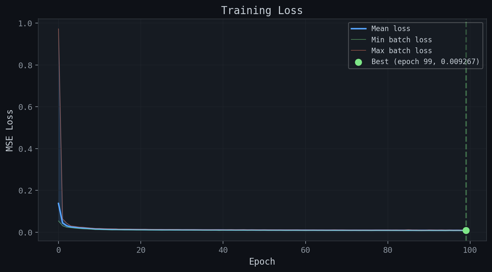

### Loss Log
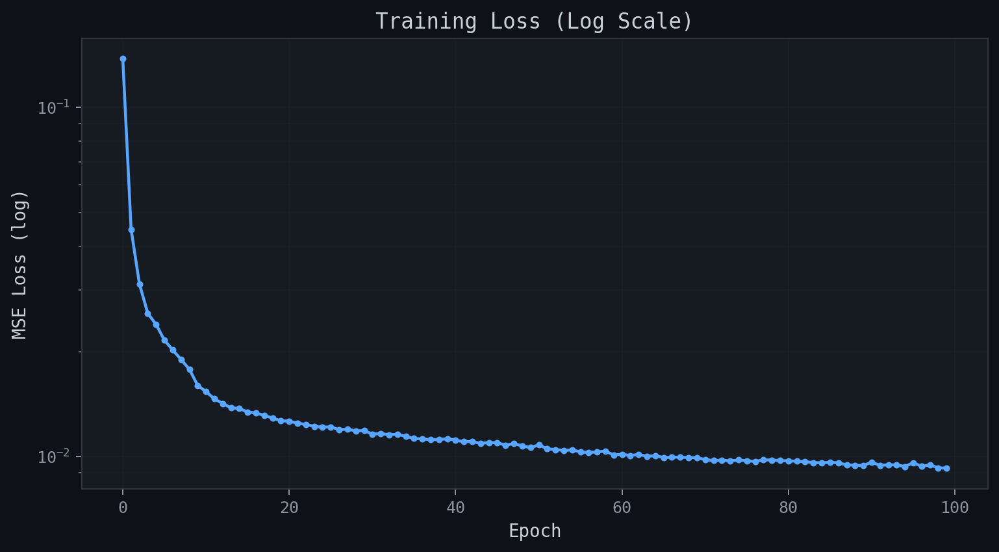

### Loss Distribution
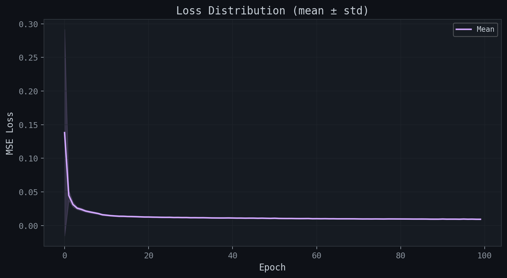

### Learning Rate
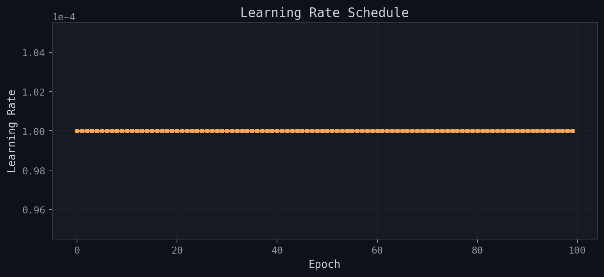

### Grad Norm
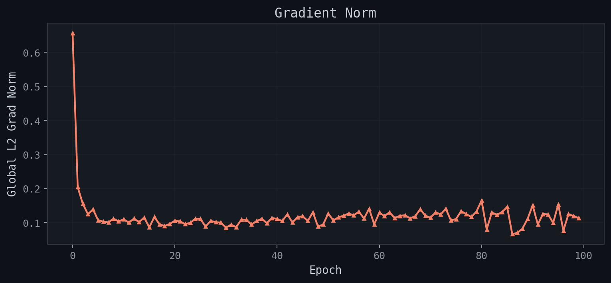

### Throughput
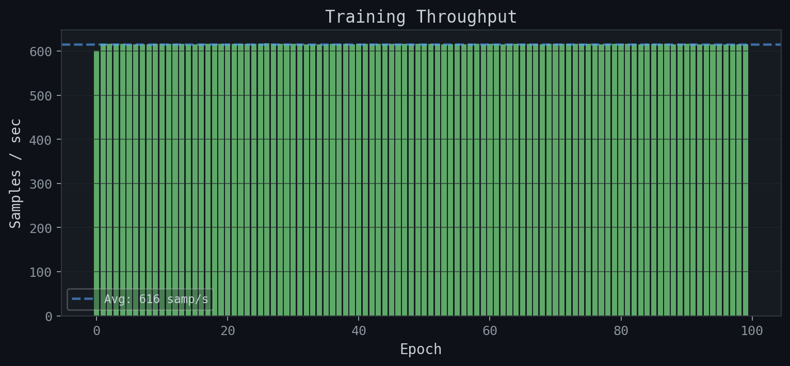

### Gpu Memory
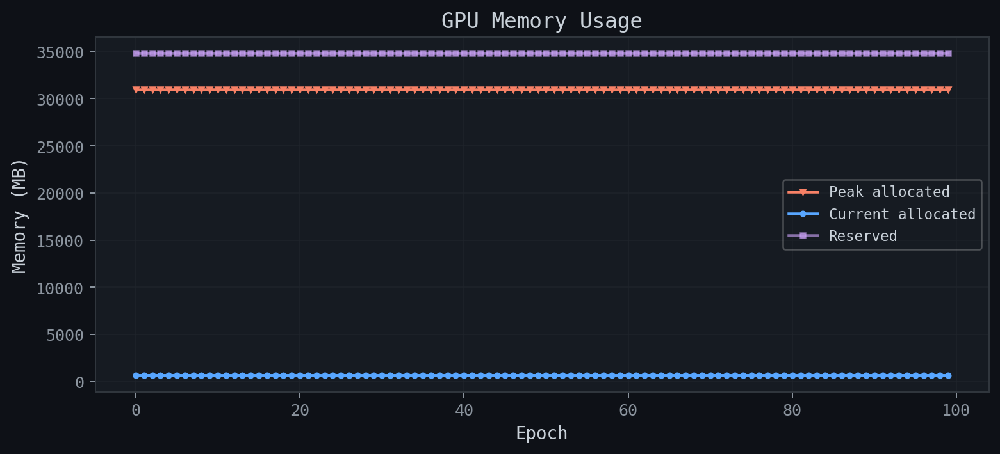

### Ema Divergence
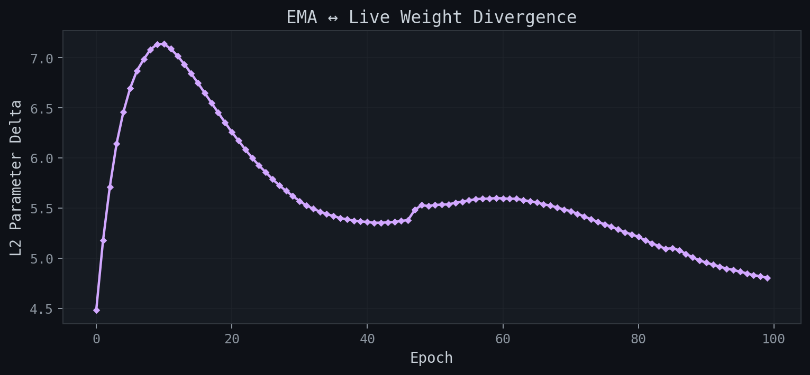

### Epoch Timing
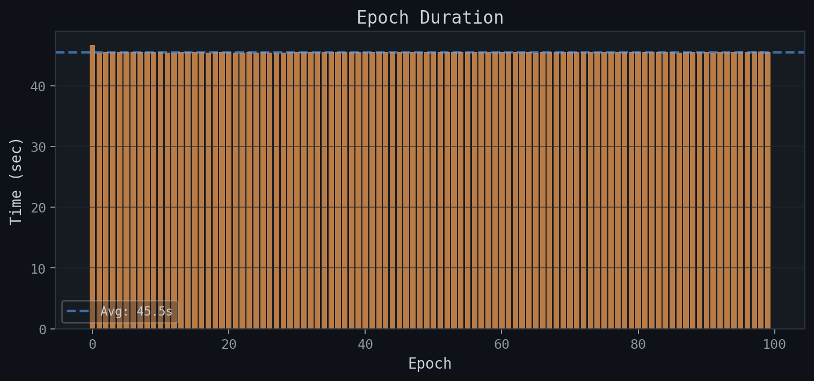

### Loss Derivative
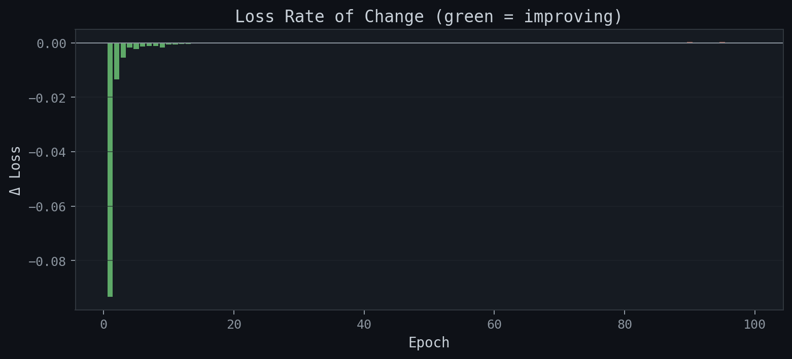

### Dashboard
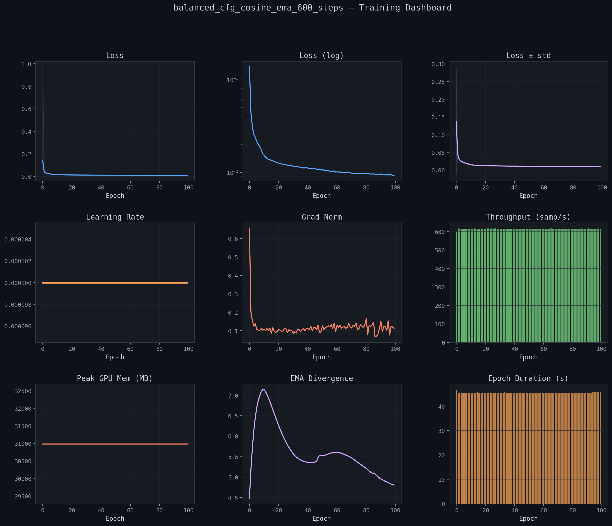

## Saved Artifacts

- **CSV metrics:** `metrics_balanced_cfg_cosine_ema_600_steps.csv`
- **JSON metrics:** `metrics_balanced_cfg_cosine_ema_600_steps.json`
- **Report:** `training_report_balanced_cfg_cosine_ema_600_steps.md`
- **Plots:** 11 images in `plots/`

---
*APEX Laboratory — The University of Chicago*
