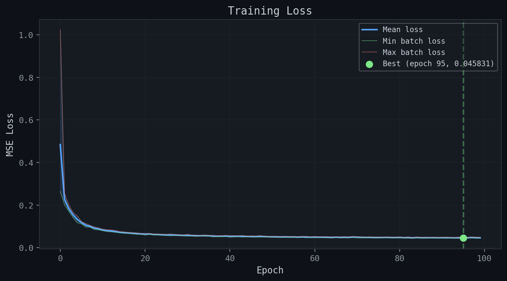
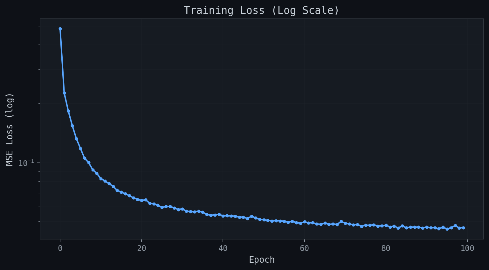
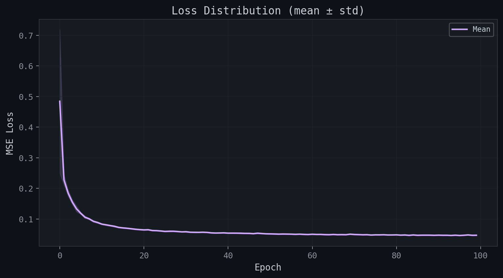
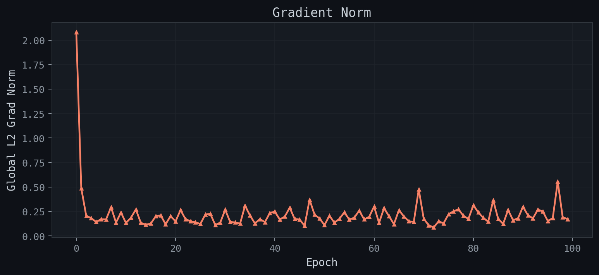
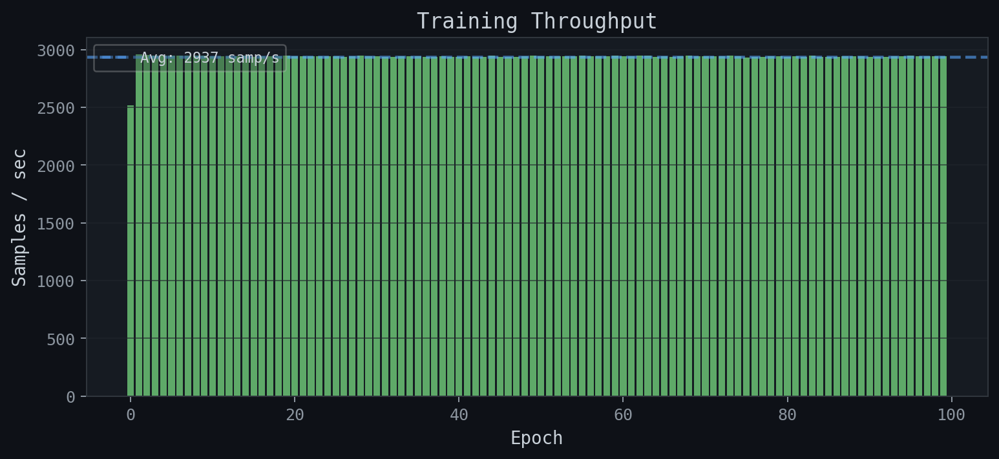
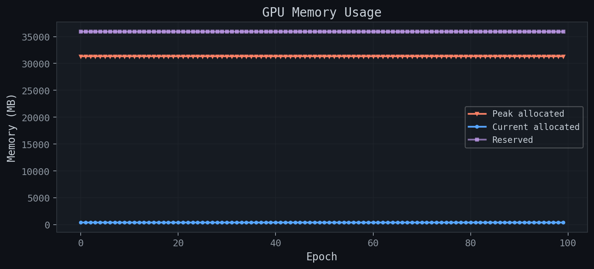
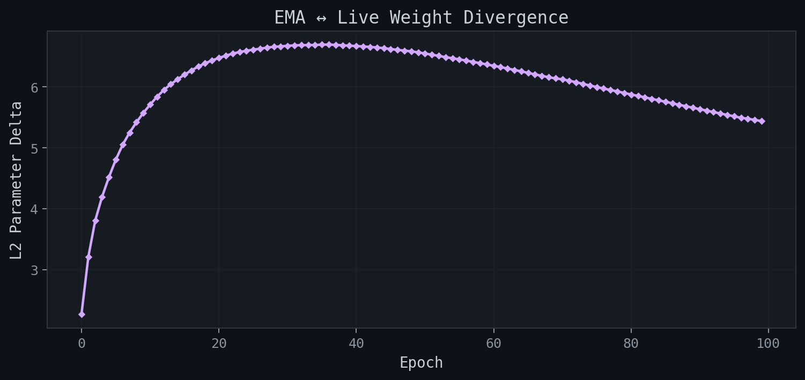
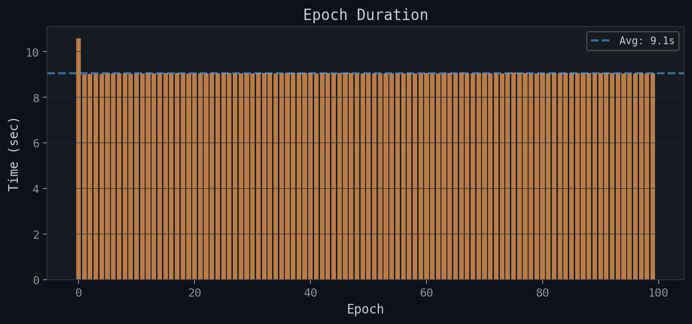
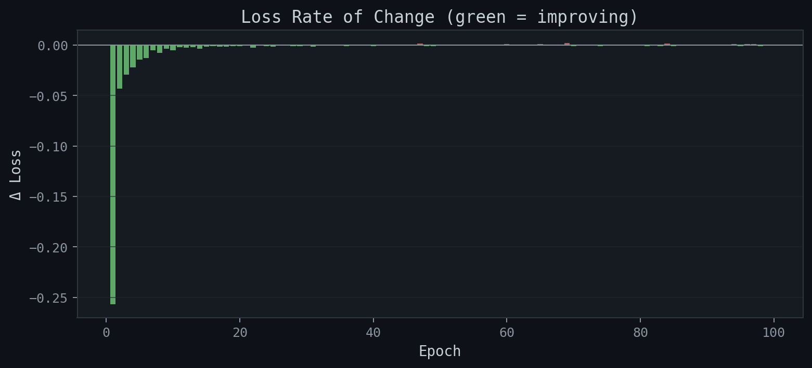
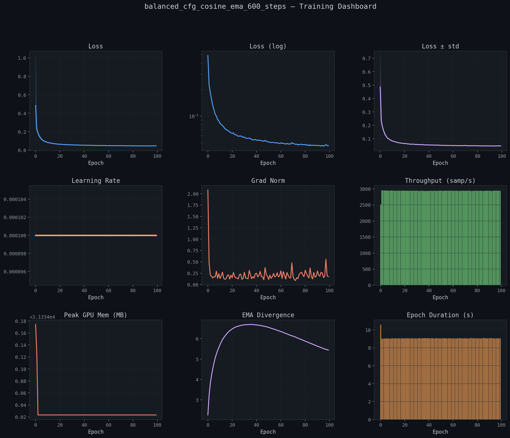

# Training Report: balanced_cfg_cosine_ema_600_steps

**Generated:** 2026-02-21 22:47:53
**Host:** midway3-0427.rcc.local
**Platform:** Linux-4.18.0-305.3.1.el8.x86_64-x86_64-with-glibc2.28
**PyTorch:** 2.9.0+cu126
**GPU:** NVIDIA L40S × 4

## Summary

| Metric | Value |
|--------|-------|
| total_epochs | 100 |
| total_samples | 2662400 |
| total_time_sec | 915.258073 |
| total_time_human | 0:15:15 |
| best_epoch | 95 |
| best_loss | 0.045831 |
| final_loss | 0.046563 |
| final_lr | 0.000100 |
| avg_throughput_sps | 2936.594280 |
| peak_gpu_mem_mb | 31334.174208 |

## Hyperparameters

```json
{
  "model_name": "balanced_cfg_cosine_ema_600_steps",
  "size_name": "small",
  "image_resolution": 28,
  "batch_size_per_gpu": 2048,
  "block_out_channels": [
    64,
    128,
    256
  ],
  "dataset_split": "balanced",
  "epochs": 100,
  "learning_rate": 0.0001,
  "diffusion_steps": 600,
  "beta_schedule": "squaredcos_cap_v2",
  "ema_decay": 0.999,
  "cfg_dropout_prob": 0.1,
  "num_classes": 47,
  "null_class_index": 47,
  "num_gpus": 4,
  "optimizer": "AdamW",
  "mixed_precision": "float16"
}
```

## Per-Epoch Metrics

| Epoch | Loss (mean) | Loss (std) | Loss (min) | Loss (max) | LR | Grad Norm | Samples/s | GPU Peak MB | EMA Δ | Time (s) |
|-------|-------------|------------|------------|------------|-----|-----------|-----------|-------------|-------|----------|
|   0 | 0.484460 | 0.234570 | 0.264642 | 1.023881 | 1.00e-04 | 2.0810 | 2517 | 31334 | 2.2639 | 10.6 |
|   1 | 0.227449 | 0.016603 | 0.202507 | 0.254838 | 1.00e-04 | 0.4879 | 2955 | 31334 | 3.2075 | 9.0 |
|   2 | 0.184027 | 0.010322 | 0.171144 | 0.200365 | 1.00e-04 | 0.2054 | 2951 | 31334 | 3.8046 | 9.0 |
|   3 | 0.154582 | 0.007613 | 0.142005 | 0.165273 | 1.00e-04 | 0.1823 | 2948 | 31334 | 4.1954 | 9.0 |
|   4 | 0.132523 | 0.009364 | 0.117985 | 0.149153 | 1.00e-04 | 0.1426 | 2948 | 31334 | 4.5191 | 9.0 |
|   5 | 0.118202 | 0.003204 | 0.111779 | 0.122281 | 1.00e-04 | 0.1706 | 2945 | 31334 | 4.8053 | 9.0 |
|   6 | 0.105407 | 0.004397 | 0.096879 | 0.113147 | 1.00e-04 | 0.1684 | 2945 | 31334 | 5.0506 | 9.0 |
|   7 | 0.100105 | 0.002561 | 0.096723 | 0.104903 | 1.00e-04 | 0.2936 | 2946 | 31334 | 5.2494 | 9.0 |
|   8 | 0.092090 | 0.002816 | 0.085139 | 0.096926 | 1.00e-04 | 0.1363 | 2946 | 31334 | 5.4191 | 9.0 |
|   9 | 0.088162 | 0.002692 | 0.084461 | 0.092832 | 1.00e-04 | 0.2392 | 2947 | 31334 | 5.5727 | 9.0 |
|  10 | 0.082943 | 0.001774 | 0.079822 | 0.086845 | 1.00e-04 | 0.1331 | 2943 | 31334 | 5.7112 | 9.0 |
|  11 | 0.080625 | 0.002547 | 0.075472 | 0.083653 | 1.00e-04 | 0.1851 | 2943 | 31334 | 5.8386 | 9.0 |
|  12 | 0.078166 | 0.002099 | 0.074625 | 0.083169 | 1.00e-04 | 0.2710 | 2939 | 31334 | 5.9510 | 9.1 |
|  13 | 0.075792 | 0.002636 | 0.072218 | 0.080349 | 1.00e-04 | 0.1339 | 2942 | 31334 | 6.0447 | 9.1 |
|  14 | 0.072268 | 0.001643 | 0.069755 | 0.075738 | 1.00e-04 | 0.1154 | 2946 | 31334 | 6.1264 | 9.0 |
|  15 | 0.070634 | 0.001568 | 0.067773 | 0.073695 | 1.00e-04 | 0.1255 | 2935 | 31334 | 6.2020 | 9.1 |
|  16 | 0.069418 | 0.001282 | 0.066706 | 0.071510 | 1.00e-04 | 0.2013 | 2944 | 31334 | 6.2706 | 9.0 |
|  17 | 0.067830 | 0.001728 | 0.064740 | 0.070272 | 1.00e-04 | 0.2098 | 2939 | 31334 | 6.3346 | 9.1 |
|  18 | 0.066167 | 0.001471 | 0.062831 | 0.069322 | 1.00e-04 | 0.1197 | 2943 | 31334 | 6.3878 | 9.0 |
|  19 | 0.065019 | 0.001492 | 0.062451 | 0.066910 | 1.00e-04 | 0.2035 | 2946 | 31334 | 6.4350 | 9.0 |
|  20 | 0.064099 | 0.001657 | 0.059405 | 0.066050 | 1.00e-04 | 0.1485 | 2942 | 31334 | 6.4760 | 9.1 |
|  21 | 0.064604 | 0.001336 | 0.062385 | 0.066641 | 1.00e-04 | 0.2643 | 2940 | 31334 | 6.5133 | 9.1 |
|  22 | 0.062024 | 0.001040 | 0.060182 | 0.063888 | 1.00e-04 | 0.1719 | 2941 | 31334 | 6.5475 | 9.1 |
|  23 | 0.061627 | 0.001245 | 0.059836 | 0.063349 | 1.00e-04 | 0.1498 | 2939 | 31334 | 6.5732 | 9.1 |
|  24 | 0.060578 | 0.001647 | 0.058339 | 0.063439 | 1.00e-04 | 0.1393 | 2943 | 31334 | 6.5939 | 9.0 |
|  25 | 0.059127 | 0.001362 | 0.057732 | 0.062759 | 1.00e-04 | 0.1221 | 2940 | 31334 | 6.6124 | 9.1 |
|  26 | 0.059686 | 0.002016 | 0.056289 | 0.064404 | 1.00e-04 | 0.2189 | 2938 | 31334 | 6.6283 | 9.1 |
|  27 | 0.059719 | 0.001455 | 0.056733 | 0.061647 | 1.00e-04 | 0.2259 | 2942 | 31334 | 6.6468 | 9.1 |
|  28 | 0.058772 | 0.001289 | 0.056488 | 0.060828 | 1.00e-04 | 0.1126 | 2945 | 31334 | 6.6594 | 9.0 |
|  29 | 0.057652 | 0.001111 | 0.055428 | 0.059560 | 1.00e-04 | 0.1354 | 2941 | 31334 | 6.6669 | 9.1 |
|  30 | 0.058056 | 0.002132 | 0.054302 | 0.062303 | 1.00e-04 | 0.2676 | 2944 | 31334 | 6.6763 | 9.0 |
|  31 | 0.056522 | 0.001288 | 0.054715 | 0.059338 | 1.00e-04 | 0.1435 | 2937 | 31334 | 6.6831 | 9.1 |
|  32 | 0.056252 | 0.001535 | 0.053212 | 0.058401 | 1.00e-04 | 0.1375 | 2934 | 31334 | 6.6860 | 9.1 |
|  33 | 0.056062 | 0.000966 | 0.054782 | 0.057474 | 1.00e-04 | 0.1253 | 2939 | 31334 | 6.6881 | 9.1 |
|  34 | 0.056519 | 0.001484 | 0.054062 | 0.058752 | 1.00e-04 | 0.3096 | 2943 | 31334 | 6.6893 | 9.0 |
|  35 | 0.055858 | 0.001039 | 0.054515 | 0.057781 | 1.00e-04 | 0.2086 | 2941 | 31334 | 6.6951 | 9.1 |
|  36 | 0.054456 | 0.001509 | 0.050989 | 0.057484 | 1.00e-04 | 0.1278 | 2934 | 31334 | 6.6956 | 9.1 |
|  37 | 0.053866 | 0.001252 | 0.051878 | 0.056189 | 1.00e-04 | 0.1725 | 2934 | 31334 | 6.6904 | 9.1 |
|  38 | 0.054061 | 0.001047 | 0.051972 | 0.055764 | 1.00e-04 | 0.1409 | 2939 | 31334 | 6.6846 | 9.1 |
|  39 | 0.054439 | 0.001370 | 0.052563 | 0.057704 | 1.00e-04 | 0.2347 | 2934 | 31334 | 6.6773 | 9.1 |
|  40 | 0.053496 | 0.001713 | 0.049253 | 0.055831 | 1.00e-04 | 0.2481 | 2937 | 31334 | 6.6716 | 9.1 |
|  41 | 0.053577 | 0.001359 | 0.050717 | 0.056126 | 1.00e-04 | 0.1684 | 2940 | 31334 | 6.6648 | 9.1 |
|  42 | 0.053468 | 0.001160 | 0.051422 | 0.055752 | 1.00e-04 | 0.1971 | 2935 | 31334 | 6.6576 | 9.1 |
|  43 | 0.053233 | 0.001841 | 0.049760 | 0.057152 | 1.00e-04 | 0.2884 | 2935 | 31334 | 6.6489 | 9.1 |
|  44 | 0.052723 | 0.000917 | 0.051070 | 0.053869 | 1.00e-04 | 0.1735 | 2946 | 31334 | 6.6368 | 9.0 |
|  45 | 0.052698 | 0.001420 | 0.049940 | 0.055195 | 1.00e-04 | 0.1676 | 2938 | 31334 | 6.6235 | 9.1 |
|  46 | 0.051841 | 0.001440 | 0.049694 | 0.054386 | 1.00e-04 | 0.1033 | 2936 | 31334 | 6.6085 | 9.1 |
|  47 | 0.053295 | 0.001590 | 0.049808 | 0.056148 | 1.00e-04 | 0.3704 | 2938 | 31334 | 6.5971 | 9.1 |
|  48 | 0.052234 | 0.001184 | 0.050139 | 0.054573 | 1.00e-04 | 0.2182 | 2941 | 31334 | 6.5845 | 9.1 |
|  49 | 0.051313 | 0.000810 | 0.049950 | 0.052773 | 1.00e-04 | 0.1785 | 2944 | 31334 | 6.5686 | 9.0 |
|  50 | 0.051071 | 0.001120 | 0.048770 | 0.052991 | 1.00e-04 | 0.1107 | 2942 | 31334 | 6.5499 | 9.0 |
|  51 | 0.050740 | 0.001408 | 0.048807 | 0.053502 | 1.00e-04 | 0.2067 | 2941 | 31334 | 6.5289 | 9.1 |
|  52 | 0.050312 | 0.001287 | 0.047903 | 0.052060 | 1.00e-04 | 0.1358 | 2941 | 31334 | 6.5102 | 9.1 |
|  53 | 0.050598 | 0.001295 | 0.048634 | 0.053019 | 1.00e-04 | 0.1741 | 2941 | 31334 | 6.4892 | 9.1 |
|  54 | 0.050413 | 0.001103 | 0.047796 | 0.051589 | 1.00e-04 | 0.2412 | 2943 | 31334 | 6.4715 | 9.0 |
|  55 | 0.050205 | 0.001260 | 0.048396 | 0.052330 | 1.00e-04 | 0.1679 | 2946 | 31334 | 6.4536 | 9.0 |
|  56 | 0.049651 | 0.001555 | 0.047459 | 0.052000 | 1.00e-04 | 0.1856 | 2942 | 31334 | 6.4326 | 9.1 |
|  57 | 0.050162 | 0.000998 | 0.048747 | 0.052794 | 1.00e-04 | 0.2589 | 2939 | 31334 | 6.4123 | 9.1 |
|  58 | 0.049430 | 0.001644 | 0.047444 | 0.053412 | 1.00e-04 | 0.1687 | 2941 | 31334 | 6.3911 | 9.1 |
|  59 | 0.049027 | 0.000876 | 0.047521 | 0.050577 | 1.00e-04 | 0.1947 | 2945 | 31334 | 6.3690 | 9.0 |
|  60 | 0.049877 | 0.001467 | 0.046793 | 0.052297 | 1.00e-04 | 0.2999 | 2940 | 31334 | 6.3469 | 9.1 |
|  61 | 0.049280 | 0.001140 | 0.046998 | 0.050939 | 1.00e-04 | 0.1331 | 2940 | 31334 | 6.3268 | 9.1 |
|  62 | 0.049344 | 0.001187 | 0.046822 | 0.051336 | 1.00e-04 | 0.2838 | 2944 | 31334 | 6.3028 | 9.0 |
|  63 | 0.048657 | 0.001514 | 0.046583 | 0.051780 | 1.00e-04 | 0.2024 | 2946 | 31334 | 6.2799 | 9.0 |
|  64 | 0.048414 | 0.001456 | 0.045541 | 0.050445 | 1.00e-04 | 0.1203 | 2934 | 31334 | 6.2560 | 9.1 |
|  65 | 0.049154 | 0.000932 | 0.047800 | 0.050748 | 1.00e-04 | 0.2629 | 2943 | 31334 | 6.2310 | 9.0 |
|  66 | 0.048390 | 0.001094 | 0.046037 | 0.050512 | 1.00e-04 | 0.2002 | 2933 | 31334 | 6.2068 | 9.1 |
|  67 | 0.048648 | 0.001411 | 0.046639 | 0.051841 | 1.00e-04 | 0.1491 | 2942 | 31334 | 6.1828 | 9.1 |
|  68 | 0.048352 | 0.001143 | 0.046341 | 0.050817 | 1.00e-04 | 0.1436 | 2945 | 31334 | 6.1595 | 9.0 |
|  69 | 0.050127 | 0.001501 | 0.047651 | 0.052565 | 1.00e-04 | 0.4750 | 2940 | 31334 | 6.1402 | 9.1 |
|  70 | 0.049058 | 0.001475 | 0.046178 | 0.051121 | 1.00e-04 | 0.1760 | 2941 | 31334 | 6.1247 | 9.1 |
|  71 | 0.048648 | 0.001072 | 0.045994 | 0.050215 | 1.00e-04 | 0.1088 | 2941 | 31334 | 6.1025 | 9.1 |
|  72 | 0.048095 | 0.000811 | 0.046479 | 0.049397 | 1.00e-04 | 0.0863 | 2941 | 31334 | 6.0769 | 9.1 |
|  73 | 0.048373 | 0.001281 | 0.046223 | 0.050600 | 1.00e-04 | 0.1490 | 2945 | 31334 | 6.0508 | 9.0 |
|  74 | 0.047292 | 0.001150 | 0.045920 | 0.050179 | 1.00e-04 | 0.1290 | 2939 | 31334 | 6.0241 | 9.1 |
|  75 | 0.047923 | 0.000903 | 0.045311 | 0.049095 | 1.00e-04 | 0.2217 | 2930 | 31334 | 5.9982 | 9.1 |
|  76 | 0.047854 | 0.000959 | 0.046514 | 0.049173 | 1.00e-04 | 0.2516 | 2938 | 31334 | 5.9732 | 9.1 |
|  77 | 0.048198 | 0.000757 | 0.047321 | 0.050042 | 1.00e-04 | 0.2719 | 2935 | 31334 | 5.9500 | 9.1 |
|  78 | 0.047477 | 0.000936 | 0.046094 | 0.049115 | 1.00e-04 | 0.2050 | 2943 | 31334 | 5.9267 | 9.0 |
|  79 | 0.047550 | 0.000890 | 0.045788 | 0.049045 | 1.00e-04 | 0.1741 | 2940 | 31334 | 5.9015 | 9.1 |
|  80 | 0.047889 | 0.000839 | 0.046488 | 0.049622 | 1.00e-04 | 0.3124 | 2937 | 31334 | 5.8761 | 9.1 |
|  81 | 0.046937 | 0.000926 | 0.045261 | 0.048269 | 1.00e-04 | 0.2408 | 2940 | 31334 | 5.8533 | 9.1 |
|  82 | 0.047485 | 0.001414 | 0.045047 | 0.049969 | 1.00e-04 | 0.1845 | 2938 | 31334 | 5.8296 | 9.1 |
|  83 | 0.046316 | 0.001049 | 0.043897 | 0.047359 | 1.00e-04 | 0.1456 | 2945 | 31334 | 5.8039 | 9.0 |
|  84 | 0.047560 | 0.001079 | 0.045927 | 0.049502 | 1.00e-04 | 0.3643 | 2935 | 31334 | 5.7797 | 9.1 |
|  85 | 0.046473 | 0.001102 | 0.045088 | 0.048574 | 1.00e-04 | 0.1746 | 2934 | 31334 | 5.7566 | 9.1 |
|  86 | 0.046858 | 0.001103 | 0.044773 | 0.048434 | 1.00e-04 | 0.1228 | 2934 | 31334 | 5.7319 | 9.1 |
|  87 | 0.046872 | 0.000788 | 0.045526 | 0.047994 | 1.00e-04 | 0.2654 | 2943 | 31334 | 5.7066 | 9.0 |
|  88 | 0.046840 | 0.001158 | 0.045247 | 0.048990 | 1.00e-04 | 0.1604 | 2940 | 31334 | 5.6827 | 9.1 |
|  89 | 0.046387 | 0.000747 | 0.045348 | 0.047754 | 1.00e-04 | 0.1800 | 2942 | 31334 | 5.6580 | 9.0 |
|  90 | 0.046893 | 0.001067 | 0.045281 | 0.048480 | 1.00e-04 | 0.2982 | 2937 | 31334 | 5.6346 | 9.1 |
|  91 | 0.046505 | 0.001055 | 0.044512 | 0.049380 | 1.00e-04 | 0.2116 | 2936 | 31334 | 5.6110 | 9.1 |
|  92 | 0.046531 | 0.000731 | 0.045373 | 0.047947 | 1.00e-04 | 0.1798 | 2934 | 31334 | 5.5872 | 9.1 |
|  93 | 0.045959 | 0.001045 | 0.044648 | 0.047855 | 1.00e-04 | 0.2689 | 2940 | 31334 | 5.5635 | 9.1 |
|  94 | 0.046796 | 0.001153 | 0.043839 | 0.049350 | 1.00e-04 | 0.2496 | 2944 | 31334 | 5.5406 | 9.0 |
|  95 | 0.045831 | 0.000626 | 0.044330 | 0.046601 | 1.00e-04 | 0.1526 | 2945 | 31334 | 5.5172 | 9.0 |
|  96 | 0.046554 | 0.000971 | 0.044730 | 0.048280 | 1.00e-04 | 0.1815 | 2944 | 31334 | 5.4937 | 9.0 |
|  97 | 0.047677 | 0.001294 | 0.045555 | 0.050257 | 1.00e-04 | 0.5561 | 2939 | 31334 | 5.4769 | 9.1 |
|  98 | 0.046423 | 0.001081 | 0.044701 | 0.049284 | 1.00e-04 | 0.1905 | 2942 | 31334 | 5.4594 | 9.1 |
|  99 | 0.046563 | 0.001070 | 0.044663 | 0.048557 | 1.00e-04 | 0.1718 | 2941 | 31334 | 5.4375 | 9.1 |

## Training Curves

### Loss Linear


### Loss Log


### Loss Distribution


### Learning Rate


### Grad Norm


### Throughput


### Gpu Memory


### Ema Divergence


### Epoch Timing


### Loss Derivative


### Dashboard


## Saved Artifacts

- **CSV metrics:** `metrics_balanced_cfg_cosine_ema_600_steps.csv`
- **JSON metrics:** `metrics_balanced_cfg_cosine_ema_600_steps.json`
- **Report:** `training_report_balanced_cfg_cosine_ema_600_steps.md`
- **Plots:** 11 images in `plots/`

---
*APEX Laboratory — The University of Chicago*
